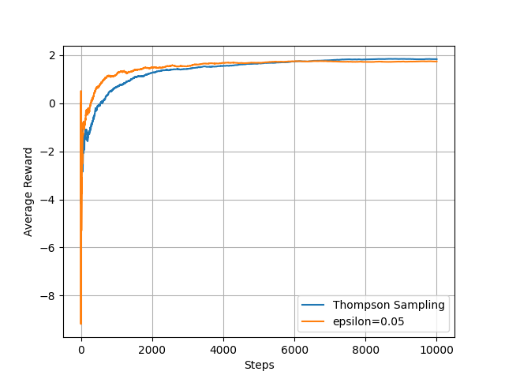

# HW2: Explore Exploit

Author: Nathan Bal

#### Instructions

*  At the end of the Python file, you'll find five different sections. To run a specific sections, simply uncomment the relevant code. A plot will be created showing the results of that sections. 

### Part 1: Epsilon-Greedy Algorithm in a Static Environment

*   After conducting multiple tests of the epsilon-greedy algorithm over 10,000 steps with 21 possible actions, the results indicate that an epsilon value of 0.05 leads to the fastest convergence. A detailed comparison of convergence rates for all epsilon values is provided in the attached plot below.

*   After implementing the Thompson Sampling method and comparing it to the best epsilon-greedy result (epsilon = 0.05), Thompson Sampling outperformed in both convergence speed and average reward. Thompson Sampling converged to a stable average reward around 7,400 steps, while the epsilon-greedy algorithm with epsilon = 0.05 converged around 8,000 steps. Additionally, Thompson Sampling achieved an average reward approximately 0.1 higher than the epsilon-greedy method. This demonstrates that Thompson Sampling not only reaches convergence faster but also performs better in terms of final rewards. This can be observed in the plot below.

### Part 2: Exploring Epsilon in the Epsilon-Greedy Algorithm

*   After implementing and comparing the quenching functions, the heavily asymptotic quenching strategy demonstrates the best balance between exploration and exploitation. This strategy maintains a high exploration rate for a significant portion of the learning process, gradually shifting towards exploitation. As shown in the graph, it achieves the fastest convergence and the highest final performance. This effective balance allows for thorough exploration while still converging to optimal actions efficiently, as evidenced by the results depicted in the plot below.

*   After implementing and testing both the weighted exploration and exclude best strategies, we can compare their behavior in terms of convergence speed and performance. The exclude best strategy shows the fastest convergence, as it forces broader exploration early on by avoiding the current best option. This allows it to quickly discover better actions, leading to higher overall performance compared to the other strategies. The weighted exploration strategy, while slower than exclude best, still converges more quickly than the standard epsilon-greedy algorithm. It prioritizes exploring less-tested actions, which helps balance exploration and exploitation better than standard epsilon-greedy. Over multiple trials, the weighted exploration strategy performance is closer to exclude best, while maintaining a noticeable improvement over the standard epsilon-greedy approach.

    In summary, these modified strategies change the balance between exploration and exploitation by encouraging more targeted exploration. The exclude best strategy, in particular, accelerates convergence by pushing the algorithm to explore alternatives early, while the weighted exploration strategy focuses on exploring underexplored actions, leading to a more balanced performance. Both strategies result in faster and more accurate learning compared to the standard approach.

### Part 3: Moving Bandits – Simulating Market Dynamics

*  Randomness plays a key role in balancing exploration and exploitation, especially under dynamic conditions like drifting bandits or sudden shifts. In these scenarios, randomness helps algorithms adapt by forcing exploration of options that may have changed in value due to the environment's shifts. However, excessive randomness can hinder convergence if it leads the algorithm to over-explore suboptimal actions, especially when better options have already been discovered. In dynamic environments, the right balance of randomness allows for quicker adaptation to changes without sacrificing long-term performance.

    When comparing the modified epsilon-greedy algorithms to the standard approach under dynamic conditions the modified version shows improved adaptability. By excluding the best option in random exploration or prioritizing less-explored actions, the algorithm is more responsive to environmental changes. This adaptability helps it maintain a higher average reward compared to the standard epsilon-greedy strategy, which tends to get stuck exploiting previously optimal actions even when the environment changes. This can be observed in the plot below where the exclude best epsilon-greedy strategy consistently performs the best. In dynamic conditions, the modified approach outperforms the standard by adapting faster to new optimal actions, leading to quicker convergence despite the downward trend in rewards.

    In the dynamic scenario with a downward drift and a sudden shift at step 3,000, all algorithms converged on a downward trajectory due to decreasing rewards. The exclude best epsilon-greedy algorithm consistently achieved the highest average reward and converged quickly. The weighted exploration is not as consistent, but still regularly out performs the standard approach. Thompson sampling without reset converged more slowly but followed a similar trend. Thompson sampling with reset, however, took the longest to adapt, showing a steeper downward slope, indicating that resetting the algorithm in the middle of a dynamic scenario may cause it to "re-learn" unnecessarily, hindering short-term performance.

